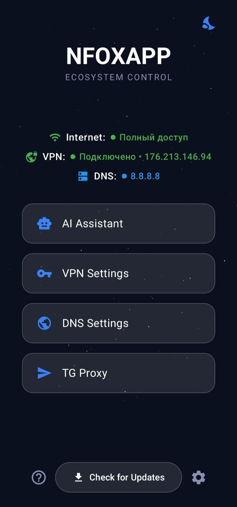

# 🦊 NFOXAPP — FoxDen

> **Your Ultimate Internet Freedom Tool**  
> *VPN • DNS • AI Assistants • Bypass Tools*

<div align="center">

[](https://github.com/Feniiiks83/FoxDenApp/actions)
[](https://github.com/Feniiiks83/FoxDenApp/releases)
[](https://kotlinlang.org)
[](LICENSE)

</div>

---

## 🖼️ Визуальное превью

---

<p align="center">
  
</p>

---

## ⚡ Ключевые возможности

### 🛡️ VPN Control
- Полноценный `VpnService` с поддержкой foreground-режима (Android 14+)
- Мониторинг подключения в реальном времени: IP, локация, пинг
- Логирование сессий с геоданными через `VpnConnectionLogger`
- Выбор конфигураций из внешних источников с авто-обновлением

### 🌐 Smart DNS & Proxy
```kotlin
// Автоматическая загрузка прокси из проверенных источников
const val SOURCE_1 = "https://raw.githubusercontent.com/Feniiiks83/.../workproxies.txt"
const val SOURCE_2 = "https://raw.githubusercontent.com/kort0881/.../proxy_ru.txt"
```
- Парсинг форматов: `tg://proxy`, `server:port:secret`, space-separated
- Параллельный пинг серверов с цветовой индикацией качества
- Кэширование результатов + сортировка по отклику
- Поддержка **MTProto** и **SOCKS5**

### 🤖 AI Integration
Встроенный WebView-доступ к нейросетям с умной генерацией ссылок:

| Модель | Описание | Специфика |
|--------|----------|-----------|
| **DeepSeek** | Код, математика, аналитика | `?q={query}` |
| **Qwen** | Многоязычная логика Alibaba | `?q={query}` |
| **Gemini** | Мультимодальный поиск Google | `?q={query}` |
| **Claude 3.5** | Работа с длинными текстами | `?prompt={query}` |
| **Arena Hub** | Все модели в одном интерфейсе | `isSpecial=true` |

### ▶️ YouTube Bypass
- Отдельный `YouTubeBypassService` с фильтрацией по пакету
- Обход региональных ограничений без влияния на основной трафик
- Интеграция с настройками **Private DNS** (Android 9+)

### 🎨 Cyberpunk UI
- **Jetpack Compose** + **Material 3** с кастомной темизацией
- **Glassmorphism**: полупрозрачные карточки с размытием и обводкой
- Адаптивная цветовая схема: `DeepSpace (#0B101E)` ↔ `LightBackground (#F0F4F8)`
- Анимированный фон с процедурной генерацией звёзд

---

## 🛠️ Технический стек

| Категория | Технологии |
|-----------|-----------|
| **Язык** | Kotlin 2.2.10, JVM Target 17 |
| **UI** | Jetpack Compose, Material 3, Coil, AndroidX WebView |
| **Архитектура** | MVVM, Repository Pattern, Coroutines + Flow |
| **Локальное хранилище** | Room Database (KSP), SharedPreferences |
| **Сеть** | Retrofit 2, OkHttp 4, jsoup, CustomTabs |
| **Сборка** | Gradle KTS, KSP, ProGuard |
| **CI/CD** | GitHub Actions (план) |
| **Мин. версия** | Android 9.0 (API 28) |

---

## 🚀 Установка и сборка

### Требования
- Android Studio **Koala+** (AGP 9.2.1)
- JDK **17** (автоматически через FooJay Toolchain Resolver)
- Android SDK **34**

### Быстрый старт
```bash
# 1. Клонируйте репозиторий
git clone https://github.com/Feniiiks83/FoxDenApp.git
cd FoxDenApp

# 2. Откройте в Android Studio
#    Или соберите через CLI:
./gradlew assembleDebug

# 3. Запустите на эмуляторе или устройстве
#    Требуется разрешение на создание VPN-подключений
```

### Переменные окружения (опционально)
```properties
# gradle.properties
# Для кастомизации сборок
android.injected.buildType=release
```

---

## 🧪 Разработка

> ⚠️ **Статус проекта: Beta**  
> Приложение находится в активной разработке. Некоторые функции могут изменяться.

### Архитектурные заметки
- `ChatRepository` реализует паттерн **WebView Shell** — логика авторизации/сессий делегирована браузеру
- `ProxyRepositoryImpl` использует **chunked parallel ping** для избежания перегрузки сети
- Все сетевые операции выполняются в `Dispatchers.IO` с обработкой ошибок через `Result<>`

### Вклад в проект
1. Создайте форк репозитория
2. Создайте ветку для фичи: `git checkout -b feature/amazing-feature`
3. Закоммитьте изменения: `git commit -m 'feat: add amazing feature'`
4. Запушьте: `git push origin feature/amazing-feature`
5. Откройте Pull Request

---

## ⚠️ Disclaimer

```
⚠️ ИНФОРМАЦИОННОЕ ПРЕДУПРЕЖДЕНИЕ

Данное приложение разработано исключительно в образовательных целях 
и для исследований в области информационной безопасности.

• Автор не несёт ответственности за использование приложения 
  в нарушение законодательства вашей юрисдикции.
• Использование сторонних прокси и VPN-сервисов может регулироваться 
  местными законами — изучите их перед применением.
• Проект не аффилирован с упомянутыми сервисами (Google, Anthropic, etc.).

Используйте на свой страх и риск.
```

---

## 📄 Лицензия

Распространяется под лицензией **MIT**. Подробности в файле [LICENSE](LICENSE).

```
Copyright © 2026 NiihoFox
Разрешается бесплатное использование, модификация и распространение
при условии сохранения уведомления об авторских правах.
```

---

## 🤝 Контакты и поддержка

- 🐦 **Telegram**: [@Feniiiks83](https://t.me/NF_tree)
- 💬 **Issues**: [Сообщить о баге](https://github.com/Feniiiks83/FoxDenApp/issues)
- ✨ **Ideas**: [Предложить фичу](https://github.com/Feniiiks83/FoxDenApp/discussions)

<div align="center">

**Made with ❤️ and Kotlin**  
*Stay free. Stay secure. Stay fox.* 🦊

</div>
